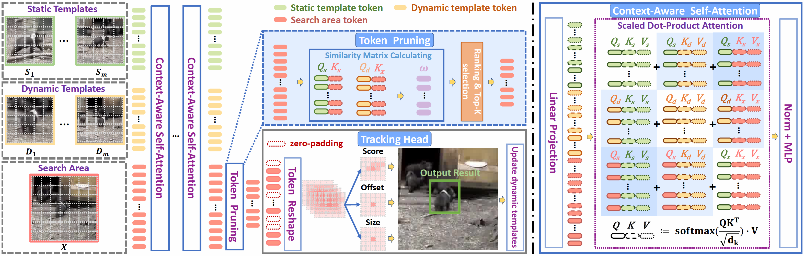

# ProContEXT

## ProContEXT: EXPLORING PROGRESSIVE CONTEXT TRANSFORMER FOR TRACKING

<p align='left'>
  
</p>

ProContEXT achieves SOTA performance on multiple benchmarks.

| Tracker     | GOT-10K (AO) | TrackingNet (AUC) |
|:-----------:|:------------:|:-----------:|
| ProContEXT | 74.6         | 84.6        |


## Quick Start

### Installation
You can refer to [OSTrack](https://github.com/botaoye/OSTrack) to install the whole environments and prepare the data.


### Set project paths
Run the following command to set paths for this project
```
python tracking/create_default_local_file.py --workspace_dir . --data_dir ./data --save_dir ./output
```
### Train
We use models offered by [MAE](https://dl.fbaipublicfiles.com/mae/pretrain/mae_pretrain_vit_base.pth) as our pretrained models. Put it under directory:
```
${PROJECT_ROOT}
    -- pretrained_models
      | -- mae_pretrain_vit_base.pth
```
Run the following command to train the model:
```shell
python tracking/train.py --script procontext --config procontext_got10k --save_dir ./output --mode multiple --nproc_per_node 4 # GOT-10k model
python tracking/train.py --script procontext --config procontext --save_dir ./output --mode multiple --nproc_per_node 4 # TrackingNet model
```

### Test
You can download the trained [model](https://drive.google.com/drive/folders/1d1kKFDoacS67_6mSsWOf3NLEY-Un1gtz?usp=share_link) and put them under directory path: 
```shell
${PROJECT_ROOT}/output/checkpoints/train/procontext/procontext_got10k/ProContEXT_ep0100.pth.tar # GOT-10k model
${PROJECT_ROOT}/output/checkpoints/train/procontext/procontext/ProContEXT_ep0300.pth.tar # TrackingNet model
```
Run the following command to test the model:
```shell
python tracking/test.py procontext procontext_got10k --dataset got10k_test --threads 16 --num_gpus 4
python tracking/test.py procontext procontext --dataset trackingnet --threads 16 --num_gpus 4
```


## Acknowledgment
Our implementation is mainly based on [OSTrack](https://github.com/botaoye/OSTrack), [Stark](https://github.com/researchmm/Stark), [pytracking](https://github.com/visionml/pytracking), and [Timm](https://github.com/rwightman/pytorch-image-models). We gratefully thank the authors for their wonderful works.


## License
This repo is released under the MIT license. Please see the LICENSE file for more information.